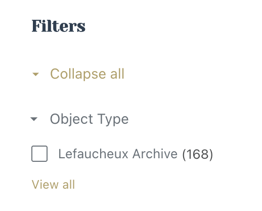
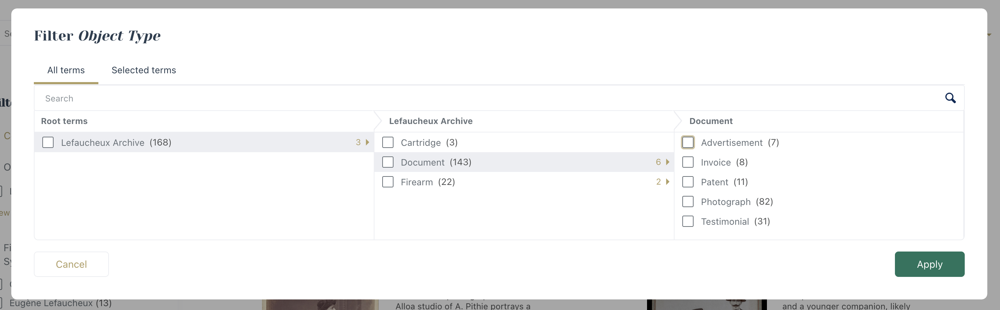

# Tainacan Sidebar Tree Filter

Replaces Tainacan's compact taxonomy filter UI (`View all` modal behavior) with an inline hierarchical tree in the sidebar, while keeping native Tainacan filtering (`taxquery[...]`) intact.

Built for the Lefaucheux Museum archive use case at [lefaucheux.com](https://lefaucheux.com), where we wanted a permanently expanded, inline taxonomy structure for archive navigation.

## What This Plugin Does

- Injects a full taxonomy tree into the existing Tainacan filters sidebar.
- Keeps filtering compatible with native Tainacan query params.
- Hides the matching native compact taxonomy filter block.
- Scopes top-level taxonomy roots to the current archive context.
- Supports collapsing:
  - native `Collapse all` / `Expand all`
  - per-tree section
  - per-branch toggles

## Installation

1. Copy this plugin folder to your WordPress plugins directory:
   - `wp-content/plugins/tainacan-sidebar-tree-filter`
2. Activate **Tainacan Sidebar Tree Filter** in WordPress admin.
3. Visit a Tainacan archive/items-list page and open filters.

## Compatibility Notes

- Built for Tainacan taxonomy filters that use `tnc_tax_*` taxonomies.
- Designed to work without modifying Tainacan core files.
- Uses DOM integration with Tainacan's current filter markup/classes.

## Screenshots

### Before (native compact filter)

Inline sidebar shows only top-level term plus `View all`:

Modal/tree selection appears in separate panel:

### After (expanded inline tree)

Full hierarchy appears inline in the sidebar:

## Development

Files:

- `tainacan-sidebar-tree-filter.php` - server-side rendering + config
- `tree.js` - DOM integration + filter behavior
- `tree.css` - style alignment with native Tainacan UI

